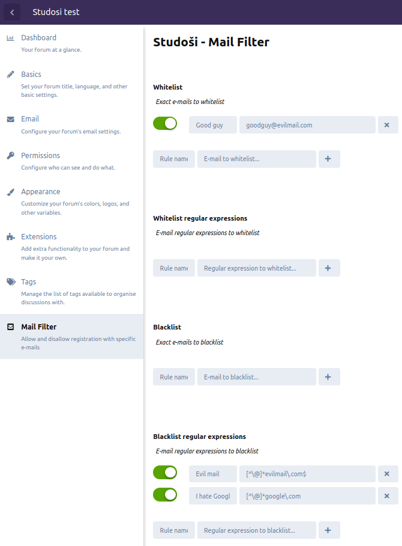
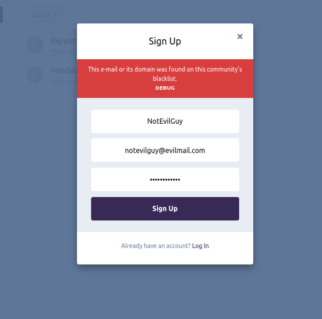
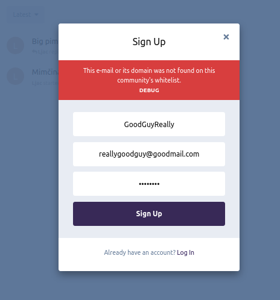

# Mail Filter

Mail Filter extension for Flarum - filter e-mail registering by your sites with whitelists, blacklists and regular expression describing both.

[](https://opensource.org/licenses/Apache-2.0) [](https://packagist.org/packages/studosi/mail-filter)

<br>

## Requirements

This extension was built and tested on Flarum 0.1.0-beta12 and PHP7.4. If you are having issues and a different build, **please** mention that you didn't use the same setup as this (so I know to test it on another environment).

Other than that, there are no prerequisites. It's really a minimal extension.

<br>

## Installation

Use [Bazaar](https://discuss.flarum.org/d/5151-flagrow-bazaar-the-extension-marketplace) or install manually with composer:

```sh
composer require studosi/mail-filter
```

<br>

## Updating

```sh
composer update studosi/mail-filter
```

<br>

## Links

- [Packagist](https://packagist.org/packages/studosi/mail-filter)
- [GitHub](https://github.com/studosi-flarum/mail-filter/)

<br>

## Screenshots





<br>

## How to use

In the admin panel, there are 4 categories of settings:

- Whitelist
- Whitelist Regular Expressions
- Blacklist
- Blacklist Regular Expressions

Using these settings categories, you can introduce various constraints on who can register for the site - in further text, we'll call these constraints **rules**.


### Whitelist and blacklist

Rules in this category will be explicitly checked if they are the same (using the `==` operator in PHP).


### Regular expression constraints

Rules in this category will be matched using `preg_match`.

Also, the browser will check if the regular expressions themselves are valid. I am not so well informed on the compatibility between JavaScript's and PHP's regex engines, so this validity check might not work as expected: in that case, submit an **Issue**.

Basically, these checks check the whole string. This is so you can potentially block certain user names, and not only domains.

Also, one last thing, this takes in **regular expressions** - languages specific things like prepending and appending a `/` to a string like in PHP is no necessary (in fact, this extension **does it by default**, without checking if such a thing already exists).

#### Example of good regular expression practices

I'll comment in short about some good practices when creating regular expression constraints for e-mails.

##### Domain limitations

For an example, if you want to filter out **gmail** emails, you'd introduce a regular expression that goes something like

```
[^\@]*gmail\.com$
```

There are a few things to note here.

First of all, you introduce a particle that goes something like `[^\@]*`. This will ensure that you cover any subdomain. This kind of expression is good for a **blacklist** (since it is strict).

The second thing to note is the terminated `.` - this is important to note for beginners because the `.` is actually an any-character alias in most if not all regex engines, and without a terminator (what we call the `\`) it can match things like `gmailacom`, `gmaillcom` etc. (note the different characters between `gmail` and `com`)

The last thing to note is the end-of-string operator (`$`). You should use it when matching domains since it reduces overhead and is punctual since domains are the **last** part of an email.

If you're creating expressions for a whitelist, you should use expressions that cover less domains, i.e.

```
\@gmail\.com$
```

This is also strict because it will only allow mails that end in `@gmail.com` to pass through, but not any subdomains of the `gmail.com` domain you might not know how to handle otherwise.

##### Username limitations

Let's say you want to filter out e-mail that starts with `mark`. Doing so is fairly trivial:

```
^mark[^\@]*
```

Note again that I'm using a `[^\@]*` pattern. Also, note that I marked the beginning of an entry with `^`. Without that, the regex engine would search the whole string for a match, which is not something you want.

But for an example, let's say you wanted to filter out e-mails that contain the word `fuck` in them (disregarding **where**). Then you could just make an entry equal to

```fuck```

or

```[Ff][Uu][Cc][Kk]```

which will be case-insensitive (although e-mails, which are URIs, are case insensitive, although I'm not sure if they're normalized by Flarum, would have to check).

<br>

## Names

Names do not have to be **unique** - they're used for micro-categorizations and will likely be searchable in the future. Also, they are required by default, not for any functional reason, but for your good. People forget things :)

<br>

## Activity

Every rule can be activated and deactivated without erasing them. This is done by using the switch left of the rule definition. When the server check if an e-mail is valid, checks for these rules will be skipped.

<br>

## Order of execution

As of now, the extension will run this:

- check if the e-mail is on an exact blacklist
  - if it is, throw a **blacklist exception**
- check if the e-mail is on a regular expression blacklist
  - if it is, set the `blacklisted` flag to `true`
- if the `blacklisted` flag is set to `true`
  - check if the e-mail is on an exact whitelist
    - if it is, allow registration
    - otherwise, throw a **blacklist exception**
- if the `blacklisted` flag is set to `false`
  - check if both whitelists are empty
    - if they are, we presume that the site does not run whitelisting, so we allow registration
  - check if we can find the e-mail on either whitelist
    - if we can, allow registration, otherwise throw a **whitelist exception**
    
In other words, the priority chain is illustrated with this:

```blacklist > whitelist > blacklist regular expression > whitelist regular expression```

Of course, other priority chains are possible (ex. `whitelist > blacklist > whitelist regular expression > blacklist regular expression`), and this might be a setting in a future release.
  
Currently, if the mail passes through the check, the function called `validate()` will return `0`, i.e. it uses C-esque returns. In the future there might be error codes added to the whole thing and exception throws might be completely moved to the `extend.php` file.

<br>

## Roadmap

- Introduce a pop-up dialog when attempting to delete a rule
- Make the GUI better looking (less plain HTML)
- Introduce list importing (it's already in the locale files but I don't have time to implement it right now)
- Create a name-based search for each list
- Clean the backend code up (I started JS and PHP programming **3 days ago**, give me some slack xD)

<br>

## About

This plugin was originally written by [Yalfoosh](https://www.github.com/Yalfoosh). It is a part of the **Studoši** community - a Croatian education forum run by academic citizens.

If you like it, give it a star :)

All Flarum open source projects by us will have the **Apache 2.0** license.

If this is not the case, or you have any other questions or inquiries, make sure to contact us at [our e-mail address](mailto:flarum_repo@studosi.net), or contact **Yalfoosh** through his [semi-business e-mail](mailto:headsouldev@gmail.com).
